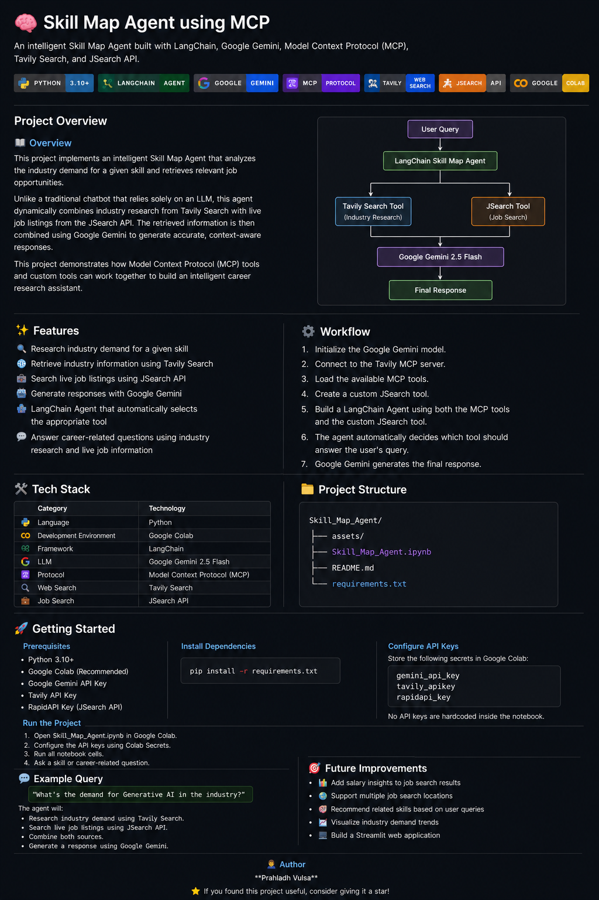

# 🧠 Skill Map Agent using MCP

An intelligent Skill Map Agent built with LangChain, Google Gemini, Model Context Protocol (MCP), Tavily Search, and JSearch API.

<p align="center">


</p>

<p align="center">
    
</p>

---

# Project Overview

## 📖 Overview

This project implements an intelligent Skill Map Agent that analyzes the industry demand for a given skill and retrieves relevant job opportunities.

Unlike a traditional chatbot that relies solely on an LLM, this agent dynamically combines industry research from Tavily Search with live job listings from the JSearch API. The retrieved information is then combined using Google Gemini to generate accurate, context-aware responses.

This project demonstrates how Model Context Protocol (MCP) tools and custom tools can work together to build an intelligent career research assistant.

---

# ✨ Features

- 🔍 Research industry demand for a given skill
- 🌐 Retrieve industry information using Tavily Search
- 💼 Search live job listings using JSearch API
- 🤖 Generate responses with Google Gemini
- 🧩 LangChain Agent that automatically selects the appropriate tool
- 💬 Answer career-related questions using industry research and live job information

---

# 🏗️ Architecture

```text
                           User Query
                                │
                                ▼
                      LangChain Skill Map Agent
                                │
             ┌──────────────────┴──────────────────┐
             │                                     │
             ▼                                     ▼
      Tavily Search Tool                  JSearch Tool
     (Industry Research)                 (Job Search)
             │                                     │
             └──────────────────┬──────────────────┘
                                ▼
                     Google Gemini 2.5 Flash
                                │
                                ▼
                         Final Response
```

---

# ⚙️ Workflow

1. Initialize the Google Gemini model.
2. Connect to the Tavily MCP server.
3. Load the available MCP tools.
4. Create a custom JSearch tool.
5. Build a LangChain Agent using both the MCP tools and the custom JSearch tool.
6. The agent automatically selects the appropriate tool based on the user's query.
7. Google Gemini generates the final response.

---

# 🛠️ Tech Stack

| Category | Technology |
|----------|------------|
| Language | Python |
| Development Environment | Google Colab |
| Framework | LangChain |
| LLM | Google Gemini 2.5 Flash |
| Protocol | Model Context Protocol (MCP) |
| Web Search | Tavily Search |
| Job Search | JSearch API |

---

# 📂 Project Structure

```text
Skill_Map_Agent/
│
├── assets/
│   └── project-overview.png
│
├── Skill_Map_Agent.ipynb
├── README.md
└── requirements.txt
```

---

# 🚀 Getting Started

## Prerequisites

- Python 3.10+
- Google Colab (Recommended)
- Google Gemini API Key
- Tavily API Key
- RapidAPI Key (JSearch API)

## Install Dependencies

```bash
pip install -r requirements.txt
```

## Configure API Keys

Store the following secrets in Google Colab:

```text
gemini_api_key
tavily_apikey
rapidapi_key
```

No API keys are hardcoded inside the notebook.

## Run the Project

1. Open `Skill_Map_Agent.ipynb` in Google Colab.
2. Configure the API keys using Colab Secrets.
3. Run all notebook cells.
4. Ask a skill-related question.

---

# 💬 Example Query

```text
What's the demand for Generative AI in the industry?
```

The agent will:

- Research industry demand using Tavily Search.
- Search live job listings using JSearch API.
- Combine both sources.
- Generate a response using Google Gemini.

---

# 🔮 Future Improvements

- 📊 Add salary insights to job search results
- 🌍 Support multiple job search locations
- 🎯 Recommend related skills based on user queries
- 📈 Visualize industry demand trends
- 💻 Build a Streamlit web application

---

# 👨‍💻 Author

**Prahladh Vulsa**

⭐ If you found this project useful, consider giving it a star!
